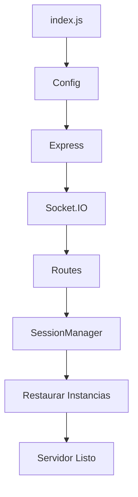
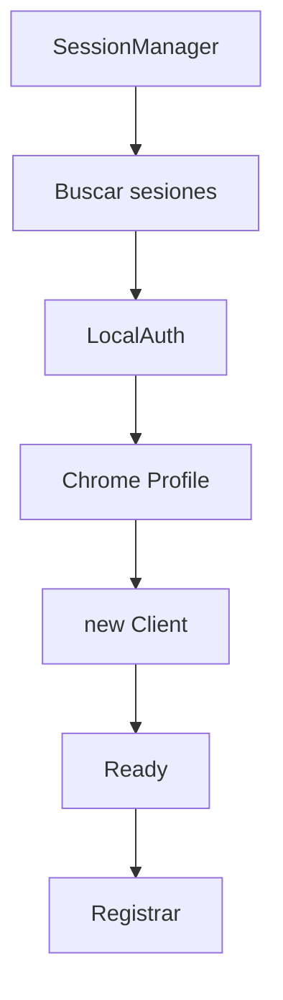

# MdI MultiWA

# 02 - FLUJOS DEL SISTEMA

Versión 1.0

---

# Objetivo

Este documento describe el recorrido de la información dentro del sistema.

Todo nuevo desarrollo deberá integrarse respetando estos flujos.

Los diagramas representan el comportamiento esperado.

---

# Índice

1. Inicio del servidor
2. Restauración de instancias
3. Nueva instancia
4. Recepción de mensajes
5. Procesamiento IA
6. Persistencia CRM
7. Actualización temporal
8. Socket.IO
9. Campañas
10. Finalización

---

# Flujo 1

## Inicio del servidor



---

Responsabilidades

✔ Inicializar Express

✔ Inicializar Socket.IO

✔ Registrar rutas

✔ Restaurar sesiones

✔ Escuchar conexiones

---

# Flujo 2

## Restauración automática



---

Objetivo

Restaurar automáticamente todas las instancias disponibles sin intervención del usuario.

---

# Flujo 3

## Creación de nueva instancia

```mermaid
flowchart TD

Usuario

↓

API

↓

SessionManager

↓

Crear LocalAuth

↓

Crear Chrome Profile

↓

new Client()

↓

QR

↓

Autenticación

↓

Ready
```

---

Regla

SessionManager es el único autorizado para ejecutar:

new Client()

---

# Flujo 4

## Recepción de mensajes

Este será el flujo más importante del sistema.

```mermaid
flowchart TD

WhatsApp

↓

whatsapp-web.js

↓

message

↓

InboundMessageHandler

↓

Filtro

↓

ConversationContext

↓

CRMFlow

↓

Gemini

↓

CRMFlow

↓

CRMManager

↓

StateManager

↓

Socket.IO

↓

Frontend
```

---

Responsabilidades

Inbound Handler

- Validar mensajes

- Ignorar basura

- Resolver contacto

ConversationContext

- Agrupar información

CRMFlow

- Actualizar negocio

CRMManager

- Persistencia

StateManager

- Estado temporal

---

# Flujo 5

## Procesamiento IA

```mermaid
flowchart TD

Mensaje

↓

Gemini

↓

Clasificación

↓

Estado

↓

Intención

↓

Respuesta

↓

CRMFlow

↓

Guardar
```

---

Información registrada

Mensaje

Prompt

Modelo

Estado IA

Intención

Respuesta

Tiempo

---

# Flujo 6

## Persistencia CRM

```mermaid
flowchart TD

CRMFlow

↓

Obtener Cliente

↓

Crear si no existe

↓

Actualizar Datos

↓

Guardar Conversación

↓

Guardar Evento

↓

Guardar Campaña

↓

Persistencia
```

---

Nunca se elimina información.

---

# Flujo 7

## Actualización temporal

```mermaid
flowchart TD

Mensaje

↓

StateManager

↓

Conversación

↓

Estado

↓

Campaña

↓

Socket
```

---

El StateManager representa únicamente el estado actual.

---

# Flujo 8

## Socket.IO

```mermaid
flowchart TD

CRM

↓

Socket.IO

↓

Frontend

↓

Actualizar UI
```

Eventos futuros

crm_actualizado

cliente_modificado

campaña_actualizada

estadisticas_actualizadas

mensaje_recibido

mensaje_enviado

---

# Flujo 9

## Campañas

```mermaid
flowchart TD

Excel

↓

Importador

↓

StateManager

↓

Campaña

↓

WhatsApp

↓

Respuesta

↓

CRM
```

---

Cada campaña deberá registrarse dentro del historial del cliente.

Nunca reemplazar campañas anteriores.

---

# Flujo 10

## Finalización

```mermaid
flowchart TD

Campaña Finalizada

↓

Vaciar StateManager

↓

Mantener CRM

↓

Esperar Nueva Campaña
```

---

El CRM nunca pierde información.

---

# Flujo futuro

```mermaid
flowchart TD

WhatsApp

Telegram

Instagram

WebChat

↓

ConversationContext

↓

CRMFlow

↓

CRMManager

↓

Base de Datos
```

Todos los canales compartirán exactamente el mismo flujo comercial.

---

# Resumen

La arquitectura separa claramente:

Persistencia

Estado temporal

Comunicación

Interfaz

Inteligencia Artificial

Esta separación permite que MdI MultiWA evolucione sin necesidad de modificar el recorrido principal de la información.

Todo nuevo módulo deberá integrarse en alguno de estos flujos.